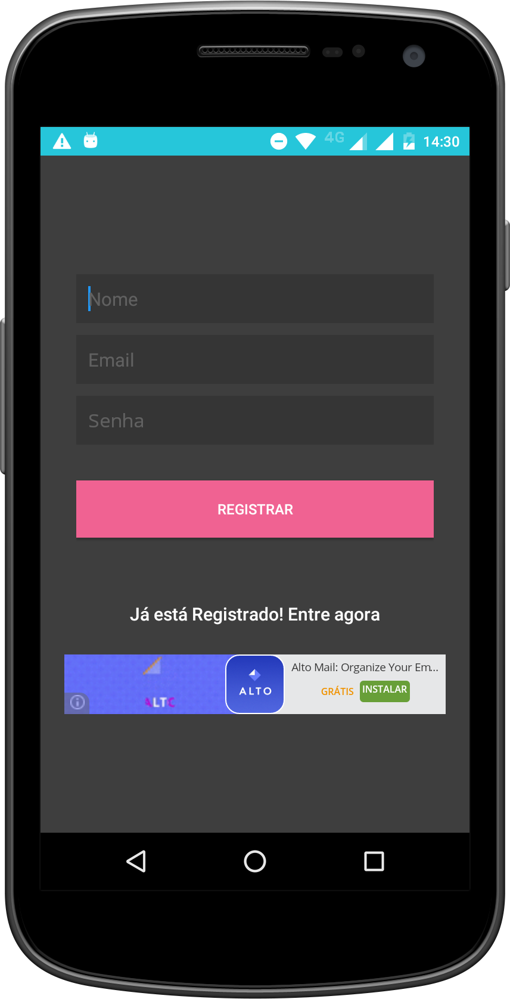
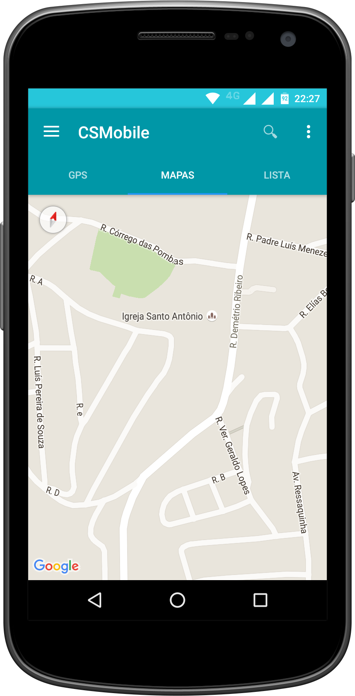

# CSMobile<h1>

* Projeto para gravar posição GPS
* Project to record GPS position
* Projeto grava localização GPS com login e registro em PHP e MySQL usando a interface Material Design
* Project that records GPS location with login and registration on PHP and MySQL using the interface Material Design
* O projeto exige o SKD 6.0 + API 23 ( AppCompatActivity + Toolbar)
* The project requires the SKD 6.0 + API 23 ( AppCompatActivity + Toolbar )
* Utiliza API GoogleMaps com tabelas dentro do Material Design
* Uses GoogleMaps API with tables within the Material Design
* Adicionado monitoramento usando Google Analytics
* Added monitoring using Google Analytics

## How to use

If you want use this library, you only have to download CS-Mobile project, import it into your workspace and add the project as a library in your android project settings.

If you prefer it, you can use the gradle dependency, you have to add these lines in your build.gradle file:

* Project: cs-mobile to include (cs-mobile)

```xml
buildscript {
    repositories {
        jcenter()
    }
    dependencies {
        classpath 'com.android.tools.build:gradle:2.0.0-beta2'
    }
}

allprojects {
    repositories {
        jcenter()
    }
}

task clean(type: Delete) {
    delete rootProject.buildDir
}
```

* Module: app to include (cs-mobile\app)

```xml
apply plugin: 'com.android.application'

android {

    compileSdkVersion 23
    buildToolsVersion '23.0.2'
    defaultConfig {
        applicationId "br.com.charlessilva"
        minSdkVersion 16
        targetSdkVersion 23
        versionCode 623
        versionName '6.0.23.0000'

    }
    buildTypes {
        release {
            minifyEnabled true
            proguardFiles getDefaultProguardFile('proguard-android.txt'), 'proguard-rules.pro'
        }
        debug {
            debuggable true
        }
    }
    productFlavors {
    }
}

dependencies {
    compile fileTree(include: ['*.jar'], dir: 'libs')
    testCompile 'junit:junit:4.12'
    compile 'com.android.support:appcompat-v7:23.1.1'
    compile 'com.android.support:design:23.1.1'
    compile 'com.google.android.gms:play-services:8.4.0'
    compile 'com.android.support:support-v4:23.1.1'
    compile 'com.google.android.gms:play-services-identity:8.4.0'
    compile 'com.google.android.gms:play-services-ads:8.4.0'
}

```

Screenshots
-----------




## License
See [LICENSE](LICENSE)

## Em desenvolvimento / Under development<h6>
